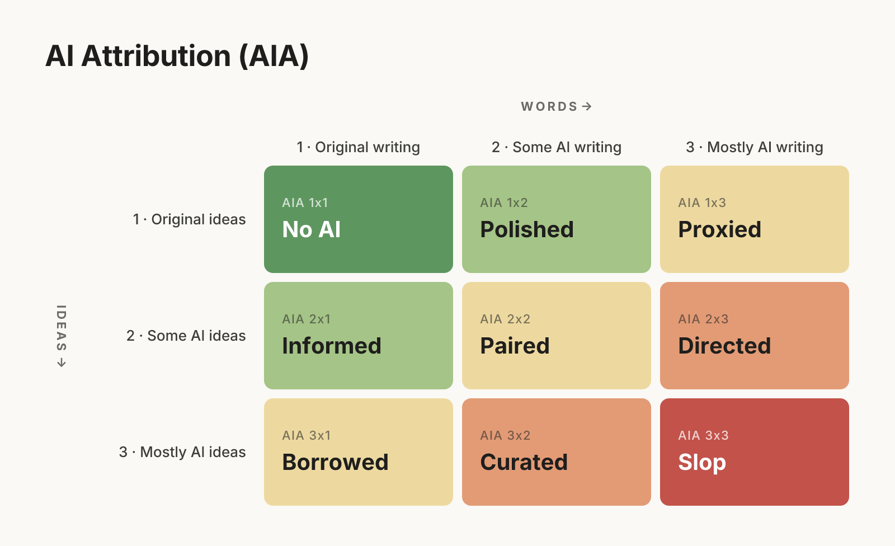
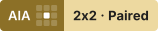
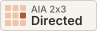
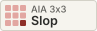
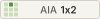
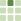

# AI Attribution (AIA)

AIA is an attribution system for writing that helps readers understand a writer's intent. It works on two axes, ideas and words, to show how much of a piece came from AI and how much from a person. The goal is to give us all an honest framework for how much attention our writing deserves.

**Website and label maker:** [AIAlabels.com](https://aialabels.com)

**Read the reasoning:** [AI Attribution (AIA): Labels for AI Writing](https://timothyfcook.com/writing/2026/is-this-worth-my-attention)



## How it works

Each label has two scores from 1 to 3, ideas first and words second. On both scales, 1 is original, 2 is some AI, and 3 is mostly AI.

| Label | Meaning |
|:---|:---|
|  | A person's own ideas and writing. Spellcheck is allowed. |
|  | The ideas and the draft were human, but AI did copyedits and redrafting. |
|  | The argument, prompts, and outline are human, but most of the writing is done by AI. |
|  | The thinking was developed with AI through research, brainstorming or debate, but a person wrote every word. |
|  | A person collaborated with AI on both the ideas and writing. |
|  | Ideas shaped together, with AI writing most text under direction. |
|  | The ideas largely came from AI, and a person wrote them up in their own words. |
|  | AI came up with the ideas and first draft. A person cut and reworked it. |
|  | Vibe writing. A person provided a minimal prompt and the AI did the rest. |

The full definitions live in [`spec.json`](spec.json), which is the source of truth for everything in this repo.

## Labels

Each label comes in full-width, medium and compact sizes, plus an icon, in color and one color. Labels start with a dark "AIA" tab and the grid, then the label on its color. Widths fit each label's text; exact sizes are in [`sizes.json`](assets/v1/sizes.json).

**Full width**<br>


**Medium**<br>


**Compact**<br>


**Text line**<br>
 **[AIA 1x2 · Polished.](https://aialabels.com/1x2)** Original ideas, some AI writing.

The easiest way to add one is the label maker at [AIAlabels.com](https://aialabels.com), which gives you copy-paste Markdown, HTML, plain text and page-head markup in every size and style. For example, in Markdown:

```markdown
[](https://aialabels.com/1x2)
```

Files are served from `https://aialabels.com/v1/<code>/<file>`, and each label has a page at `https://aialabels.com/<code>` (e.g. [aialabels.com/1x2](https://aialabels.com/1x2)):

| File | What it is |
|---|---|
| `wide.svg`, `wide.png`, `wide@2x.png` | Full-width label: code, name and summary (31px tall) |
| `medium.svg`, `medium.png`, `medium@2x.png` | Medium label: code and name (31px tall) |
| `compact.svg`, `compact.png`, `compact@2x.png` | Compact label: code and name (19px tall) |
| `icon.svg`, `icon.png` | 3×3 grid icon |

Add `-mono` before the extension for the one-color version (e.g. `medium-mono.svg`). Exact sizes for every label are in [`sizes.json`](assets/v1/sizes.json). The chart comes in two styles, [`chart.png`](assets/v1/chart.png) (grid) and [`chart-icons.png`](assets/v1/chart-icons.png) (each label's icon), also as SVG. Everything is also in [`aia-labels-v1.zip`](assets/v1/aia-labels-v1.zip).

## Website

The AIA website, [AIAlabels.com](https://aialabels.com), is a small static site in [`site/`](site/), deployed with Netlify ([`netlify.toml`](netlify.toml)). Its build (`scripts/build-site.mjs`) copies `assets/v1/` into the site and writes a page for each label from [`templates/label.html`](templates/label.html), so it always matches the spec. To preview it locally, run `npm run build:site` and serve the `site/` folder.

## Versioning

Published files never change. Pages around the web link to `https://aialabels.com/v1/...` (and, for early labels, `https://timothyfcook.com/aia/v1/...`), so editing a v1 file would silently change every page that uses it. Changes to names, definitions or the design go into a new version (`v2`) with its own folder and URLs.

## Contributing

Suggestions, critiques and fixes are welcome. See [CONTRIBUTING.md](CONTRIBUTING.md), or [open an issue](https://github.com/timothyfcook/aia/issues/new/choose).

## License

- The AIA spec, labels, icons and chart are licensed under [CC BY 4.0](https://creativecommons.org/licenses/by/4.0/) ([full text](LICENSE-CC-BY-4.0.txt)). A label linked to its page counts as credit.
- The generator code in `scripts/` is licensed under the [MIT License](LICENSE).
