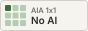
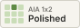
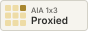
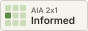
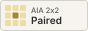
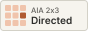
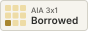
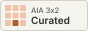
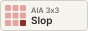
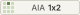

# AI Attribution (AIA)

AIA is an attribution system for writing that helps readers understand a writer's intent. It works on two axes, ideas and words, to show how much of a piece came from AI and how much from a person. The goal is to give us all an honest framework for how much attention our writing deserves.

**Get a label for your writing:** [timothyfcook.com/aia](https://timothyfcook.com/aia)

**Read the reasoning:** [AI Attribution (AIA): Labels for AI Writing](https://timothyfcook.com/writing/2026/is-this-worth-my-attention)


## How it works

Each label has two scores from 1 to 3, ideas first and words second. On both scales, 1 is original, 2 is some AI, and 3 is mostly AI.

| Badge | Meaning |
|---|---|
|  | A person's own ideas and writing. Spellcheck is allowed. |
|  | The ideas and the draft were human, but AI did copyedits and redrafting. |
|  | The argument, prompts, and outline are human, but most of the writing is done by AI. |
|  | The thinking was developed with AI through research, brainstorming or debate, but a person wrote every word. |
|  | A person collaborated with AI on both the ideas and writing. |
|  | The ideas were shaped together and AI wrote the text, with a person steering and editing. |
|  | The ideas largely came from AI, and a person wrote them up in their own words. |
|  | AI came up with the ideas and first draft. A person cut and reworked it. |
|  | Vibe writing. A person provided a minimal prompt and the AI did the rest. |

The full definitions live in [`spec.json`](spec.json), which is the source of truth for everything in this repo.

## Badges

Each label comes as a full-width badge, an 88×31 badge (the classic Creative Commons button size), an 80×15 compact badge and an icon, in color and one color.

Shown here at 2×; on a page they display at their real size.

**Full width**<br>


**Medium (88×31)**<br>


**Compact (80×15)**<br>


The easiest way to add one is the chooser at [timothyfcook.com/aia](https://timothyfcook.com/aia), which gives you copy-paste Markdown, HTML and plain text. For example, in Markdown:

```markdown
[](https://timothyfcook.com/aia/1x2)
```

Files are served from `https://timothyfcook.com/aia/v1/<code>/<file>`:

| File | What it is |
|---|---|
| `wide.svg`, `wide.png`, `wide@2x.png` | Full-width badge: icon, code, name and summary |
| `88x31.svg`, `88x31.png`, `88x31@2x.png` | Medium badge |
| `80x15.svg`, `80x15.png`, `80x15@2x.png` | Compact badge |
| `icon.svg`, `icon.png` | 3×3 grid icon |

Add `-mono` before the extension for the one-color version (e.g. `88x31-mono.svg`). Everything is also in [`aia-badges-v1.zip`](assets/v1/aia-badges-v1.zip).

## Versioning

Published files never change. Pages around the web link to `https://timothyfcook.com/aia/v1/...`, so editing a v1 file would silently change every page that uses it. Changes to names, definitions or the design go into a new version (`v2`) with its own folder and URLs.

## Contributing

Suggestions, critiques and fixes are welcome. See [CONTRIBUTING.md](CONTRIBUTING.md), or [open an issue](https://github.com/timothyfcook/aia/issues/new/choose).

## License

- The AIA spec, badges, icons and chart are licensed under [CC BY 4.0](https://creativecommons.org/licenses/by/4.0/) ([full text](LICENSE-CC-BY-4.0.txt)). A badge linked to its label page counts as credit.
- The generator code in `scripts/` is licensed under the [MIT License](LICENSE).
